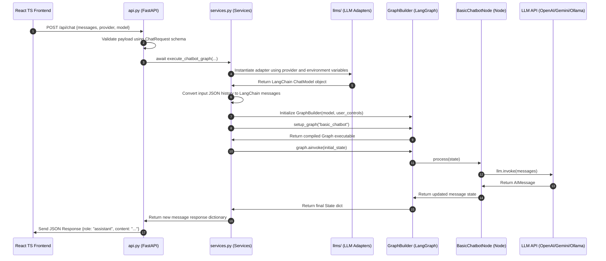

# 🤖 Autonomous Multi-Agent Playground

Welcome to the **Autonomous Multi-Agent Playground**! This repository hosts a fully functional, highly modular **React + Vite (TypeScript) frontend** integrated with a robust **FastAPI + LangGraph backend** that orchestrates multiple Large Language Model (LLM) agents.

The playground features a responsive chat dashboard allowing you to switch between different LLM providers and models on the fly, with live credential checking and interactive conversational state streams.

---

## 🚀 Key Features

* **Modular LangGraph StateGraph Orchestration:** Employs compiled async state graph execution topologies via `GraphBuilder`.
* **Dynamic Multi-LLM Adapter Layer:** Unified interfaces for major LLM providers:
  * **OpenAI** (`gpt-4o-mini`, `gpt-4o`, `gpt-4.5-preview`)
  * **Anthropic** (`claude-3-5-sonnet-latest`, `claude-3-5-haiku-latest`)
  * **Google Gemini** (`gemini-2.5-flash`, `gemini-2.5-pro`, `gemini-1.5-flash`)
  * **Groq** (`llama-3.3-70b-versatile`, `mixtral-8x7b-32768`, `gemma2-9b-it`)
  * **Ollama** (Support for local offline models: `llama3`, `mistral`, `phi3`, etc.)
* **Live Server Settings & Key Verification:** The backend scans your `.env` configuration at startup and securely advertises the presence of API keys to the frontend, disabling/enabling dropdown selections accordingly.
* **Premium Dark-Mode Interface:** A modern, state-of-the-art chat workspace with smooth HSL color schemes, interactive sidebars, network-resilient error banners, and active typing loading micro-animations.

---

## 📂 Project Architecture

The codebase is split into two primary folders, representing a clean decoupling of the client and backend layers:

```text
Autonomous-Multi-Agent/
├── frontend/                  # React 19 + TypeScript + Vite Client App
│   ├── src/
│   │   ├── main.tsx           # Application entry point
│   │   ├── App.tsx            # Master application state orchestrator
│   │   ├── App.css            # Custom HSL-based styles & animations
│   │   ├── index.css          # CSS reset guidelines
│   │   ├── types.ts           # Centralized TypeScript interface declarations
│   │   ├── components/        # Isolated sub-components (Header, MessageList, ChatInput, SettingsModal)
│   │   └── utils/             # Helper modules (storage persistence)
│   └── package.json           # Frontend dependency manifest
│
├── orchestrator_agent/        # FastAPI Python Backend
│   ├── api.py                 # FastAPI endpoints & CORS routers
│   ├── config.py              # Environment checking & model catalog mapping
│   ├── schemas.py             # Strict Pydantic parsing and validation models
│   ├── services.py            # LangGraph pipeline driver and LLM instantiator
│   ├── states/
│   │   └── chatbotState.py    # LangGraph conversational typing dict
│   ├── graphs/
│   │   ├── graph_builder.py   # StateGraph compilation orchestrator
│   │   └── basic_chatbot_graph.py # Node-Edge graph layout
│   ├── nodes/
│   │   └── basic_chatbot_node.py  # LLM execution node wrapper
│   ├── llms/                  # Decoupled provider-specific LLM adapters
│   │   ├── openai_llm.py
│   │   ├── gemini_llm.py
│   │   ├── groq_llm.py
│   │   ├── anthropic_llm.py
│   │   └── ollama_llm.py
│   ├── prompts/
│   │   └── prompts.py         # Dynamic tone and name voice prompt builder
│   ├── tools/                 # Setup hooks for custom local tool wrappers
│   ├── stores/                # Checkpointer backend storage connectors
│   └── mcps/                  # Setup hooks for Model Context Protocol systems
│
├── example.env                # Standard template for credential setup
├── pyproject.toml             # Python build dependencies & project meta
└── README.md                  # This documentation file
```

---

## 🔄 End-to-End Chat Execution Flow

When you send a message, the request traverses a strict, modular pipeline:



---

## 🛠️ Installation & Setup

### 1. Environment Setup

Copy `example.env` into a new `.env` file in the root directory:

```bash
# On Linux/macOS
cp example.env .env

# On Windows (PowerShell)
copy example.env .env
```

Open `.env` and fill in the API keys for the providers you intend to use:

```env
OPENAI_API_KEY=your_openai_key_here  #https://platform.openai.com/api-keys
GEMINI_API_KEY=your_gemini_key_here #https://aistudio.google.com/api-keys?project=gmail-mcp-465017
GROQ_API_KEY=your_groq_key_here  #https://console.groq.com/keys
ANTHROPIC_API_KEY=your_anthropic_key_here #https://platform.claude.com/settings/workspaces/default/keys
OLLAMA_BASE_URL=http://localhost:11434  # Optional, default Ollama port #https://ollama.com/download
```

> [!NOTE]
> The backend server does not require all API keys to start. The UI dynamically detects which keys are missing and restricts selection, making setup stress-free.

---

### 2. Running the Backend (FastAPI)

Ensure you have a modern Python environment installed (Python `>= 3.13` recommended).

#### Using `uv` (Recommended)

This project uses the modern `uv` runner to sync/install dependencies and start the API. Run:

```bash
# Sync/install project dependencies and start the API with uv
uv run uvicorn orchestrator_agent.api:app --host 127.0.0.1 --port 8080 --reload
```

The backend server will run at `http://127.0.0.1:8080`.

---

### 3. Running the Frontend (React + Vite)

You can run the frontend either by navigating to the folder or directly from the project root.

#### Option A: Running from the Root Directory (Quickest)
You can use the `--prefix` flag to run `npm` commands for a subfolder without leaving the root directory:

# Install NPM
https://nodejs.org/en/download
```bash
# Install dependencies from root
npm install --prefix frontend

# Start the Vite development server from root
npm run dev --prefix frontend
```

#### Option B: Running from the `frontend/` Directory
```bash
# Navigate to client folder
cd frontend

# Install Node modules
npm install

# Start local server
npm run dev
```

Open `http://localhost:5173` in your browser to start playing with the agent!

---

## 🏛️ Design Patterns Applied

1. **Unified Adapter Pattern:** Decouples the concrete APIs of OpenAI, Anthropic, Gemini, Groq, and Ollama from the core execution engine. The service layers communicate with a standardized LangChain interface, enabling zero-overhead support for new LLMs.
2. **Stateless Request-Response Design:** The backend is serverless-friendly and performant. Conversation state resides entirely on the client, which forwards the chronological history list with each POST request.
3. **Strict State Anchoring:** Uses LangGraph's `StateGraph` accompanied by an annotated `add_messages` history accumulator to guarantee clean, traceable state tracking inside graph flows.

---

## ⚡ Future Roadmap

* [ ] **Tool Calling Integrations:** Hook up custom local tools (web searchers, database queries, calculators) using LangGraph's native tool execution edges.
* [ ] **Multi-Agent Teams:** Setup Supervisor router nodes directing queries to specific sub-graphs (e.g. standard developer agent, researcher agent).
* [ ] **Long-term Memory Persistence:** Implement database or Redis-backed message thread checking to allow persistent sessions.
