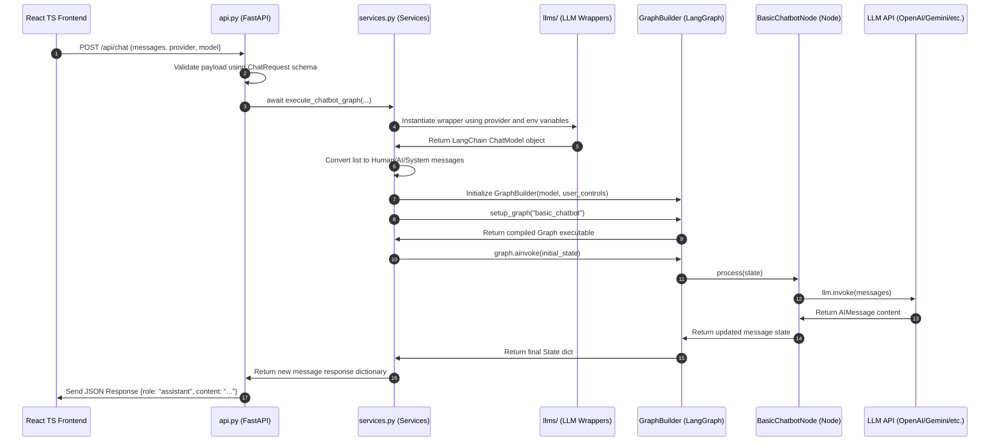

# Backend Architecture & Flow Implementation (`orchestrator_agent`)

This document provides a comprehensive technical mapping of the modular FastAPI backend implemented inside the `orchestrator_agent` directory.

---

## 📂 Modular Directory Map

The backend is structured into specialized, decoupled modules to ensure scalability and ease of debugging:

```
orchestrator_agent/
├── __init__.py
├── api.py            # API controller & routing layer
├── config.py         # Global configuration, model registries, & env loading
├── schemas.py        # Pydantic validation models
├── services.py       # LLM wrappers & LangGraph graph execution logic
├── states/
│   └── chatbotState.py  # LangGraph run-time State definition
├── graphs/
│   ├── graph_builder.py # StateGraph builder class
│   └── basic_chatbot_graph.py  # Node and Edge configuration
├── nodes/
│   └── basic_chatbot_node.py   # LLM execution node
└── llms/             # Unified langchain interfaces for AI providers
    ├── openai_llm.py
    ├── gemini_llm.py
    ├── groq_llm.py
    ├── anthropic_llm.py
    └── ollama_llm.py
```

---

## ⚙️ Module Specifications

### 1. Configuration Layer (`config.py`)

- **Responsibility**: Loads `.env` file environment variables and acts as the central source of truth for supported providers.
- **Key Entities**:
  - `AVAILABLE_MODELS`: Dictionary mapping supported provider identifiers (`openai`, `gemini`, etc.) to lists of default model names.
  - `get_provider_key_status()`: Scans the process environment and returns boolean flags reflecting if default API credentials are set in the `.env` file. This lets the API advertise key presence securely to the React client.

### 2. Validation Layer (`schemas.py`)

- **Responsibility**: Houses strict Pydantic validation schemas to safeguard input and output boundaries.
- **Key Schemas**:
  - `ChatMessage`: Enforces valid conversation structure (must contain exactly `role` and `content`).
  - `ChatRequest`: Enforces structure for conversational prompts:
    ```python
    class ChatRequest(BaseModel):
        messages: List[ChatMessage]
        provider: str
        model: str
    ```

### 3. Orchestration Layer (`services.py`)

- **Responsibility**: Bridges the HTTP controller layer with LangChain wrappers and the LangGraph engine.
- **Key Functions**:
  - `get_base_llm(provider, model)`: Dynamically instantiates the target base LLM client based on selected provider using server-side environment variables loaded from `.env`.
  - `to_langchain_messages(messages)`: Translates JSON Pydantic data payloads into LangChain-compliant message objects (`HumanMessage`, `AIMessage`, `SystemMessage`).
  - `execute_chatbot_graph(messages, provider, model)`: Async routine that initializes the model, launches the compiled `GraphBuilder`, runs the state graph asynchronously, and returns the response message structure.

### 4. Router Controller (`api.py`)

- **Responsibility**: Standard FastAPI framework endpoint definitions.
- **Endpoints**:
  - `GET /api/settings`: Returns configured provider availability metadata.
  - `POST /api/chat`: Validates request bodies against `ChatRequest` and runs the services pipeline.

---

## 🔄 End-to-End Chat Execution Flow

When a user submits a prompt, the data travels through the following sequence:



---

## 🛠️ Design Patterns Applied

1. **Adapter / Wrapper Pattern**: The directory `llms/` provides uniform wrapping around varied APIs (Gemini uses `ChatGoogleGenerativeAI`, OpenAI uses `ChatOpenAI`, etc.), meaning `services.py` can interact with any of them identically using `.invoke()`.
2. **Stateless Request-Response Pattern**: The backend does not maintain a database for message threads. The full chat history is managed by the client application and provided in the POST request. This keeps the backend highly performant, serverless-friendly, and eliminates database connection overhead.
