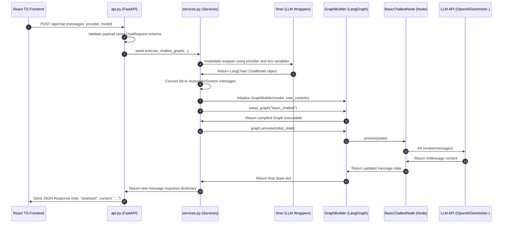

# Backend Architecture & Flow Implementation (`orchestrator_agent`)

This document provides a comprehensive technical mapping of the modular FastAPI backend implemented inside the `orchestrator_agent` directory.

---

## 📂 Modular Directory Map

The backend is structured into specialized, decoupled modules to ensure scalability, ease of debugging, and absolute separation of concerns:

```
orchestrator_agent/
├── __init__.py
├── api.py               # HTTP Controller: FastAPI routing, endpoints, CORS middleware
├── config.py            # Configuration: Model catalogs, voice tones, env loaders
├── schemas.py           # Validation: Pydantic schemas validating input/output payloads
├── services.py          # Service Layer: Dynamic LLM selection, checkpointer orchestration
├── states/
│   └── chatbotState.py  # Run-time State: ChatbotState structure with history annotators
├── graphs/
│   ├── graph_builder.py # Compiler: LangGraph StateGraph assembler using MemorySaver
│   └── basic_chatbot_graph.py # Routing Layout: Graph routing edges (START -> Chatbot -> END)
├── nodes/
│   └── basic_chatbot_node.py  # Agent Processor: Execution unit feeding LLMs and formatting AIMessages
├── llms/                # LLM Adapters: Decoupled client wrappers for distinct AI providers
│   ├── openai_llm.py
│   ├── gemini_llm.py
│   ├── groq_llm.py
│   ├── anthropic_llm.py
│   └── ollama_llm.py
├── prompts/
│   └── prompts.py       # Prompt Templates: Dynamic system prompts matching name and tone settings
├── tools/               # Extension Layer: Pre-configured hooks for local custom utilities
├── stores/              # Database Layer: File/db system handlers for long-term storage
└── mcps/                # Protocol Layer: Setup hooks for Model Context Protocol utilities
```

---

## 📄 Detailed File Breakdown & Architecture ("Why")

Below is a detailed analysis of what each backend file implements and the architectural reasoning ("why") behind its design:

### 1. `config.py` (Global Parameters)
* **What it is**: Houses global constants:
  * `AVAILABLE_MODELS`: Mapping of provider channels (OpenAI, Gemini, Groq, Anthropic, Ollama) to lists of default LLM names.
  * `TONES`: Array of pre-seeded assistant voices (`friendly`, `professional`, `mature`).
  * `get_env_variable()`: A failsafe wrapper to fetch process environmental credentials.
* **Why**:
  * **Unified Registry**: Centralizes all model lists in a single place. If a developer wants to add new models, they only need to modify `AVAILABLE_MODELS` here.
  * **Environmental Isolation**: Decouples active keys check from endpoints, keeping configuration separate from execution logic.

### 2. `schemas.py` (Data Validation)
* **What it is**: Enforces strict Pydantic structures for serialization boundaries:
  * `ChatMessage`: Maps role and content strings.
  * `PromptConfig`: Sets defaults for name (`Jarvis`) and tone (`friendly`).
  * `ChatRequest`: Structures conversational prompts, mapping message lists, active LLM choices, and custom thread IDs.
  * `ProviderDetail` & `SettingsResponse`: Structures settings catalog metadata for React select menus.
* **Why**:
  * **Clean Serialization Bounds**: Ensures incoming requests match precise formatting contracts before hitting Graph pipelines, avoiding runtime parsing failures.
  * **OpenAPI Schema Generation**: Allows FastAPI to automatically document API payloads and support automatic client-side code generation.

### 3. `prompts/prompts.py` (Dynamic System Prompts)
* **What it is**: Formats prompt strings with specific guidelines matching designated tones:
  * `friendly`: Warm, enthusiastic, supportive, and uses friendly emojis.
  * `mature`: Calm, wise, thoughtful, direct, and avoids emojis.
  * `professional`: Formal, concise, authoritative, objective, and professional.
* **Why**:
  * **Voice Separation**: Decouples formatting logic from graph execution nodes, keeping prompts highly maintainable and easily modifiable.

### 4. `states/chatbotState.py` (Conversational State)
* **What it is**: Declares the `ChatbotState` class as a TypedDict container:
  * `messages`: Annotated using LangGraph's `add_messages` reducer to automatically append new conversational turns to the checkpoint log.
  * `provider`, `model`, `chatbot_name`, `tone`: Metadata strings captured inside runtime checkpoints.
* **Why**:
  * **State Accumulator**: LangGraph depends on type annotations to merge new dialogue turns correctly. The `add_messages` reducer handles append operations behind the scenes.
  * **Rich Metadata Checkpoints**: Storing provider, name, and tone in state allows the system to reconstruct the exact configuration context of any thread during execution.

### 5. `nodes/basic_chatbot_node.py` (Execution Unit)
* **What it is**: Implements the `BasicChatbotNode` process logic:
  * Passes conversation messages to the target base LLM.
  * Captures the response content and normalizes it into a standard LangChain `AIMessage` container, handling string, dict, or message inputs gracefully.
* **Why**:
  * **Input Normalization**: Language models sometimes return differing output schemas (raw content strings, dict logs, or direct message formats). The processor acts as a defensive wrapper to ensure only valid `AIMessage` units append to thread states.
  * **Pure Execution Node**: Keeps processing code decoupled from the routing layout.

### 6. `graphs/basic_chatbot_graph.py` (Routing Topologies)
* **What it is**: Assembles graph workflows:
  * Sets the "chatbot" processor node.
  * Configures routing edges: maps `START` directly to the `chatbot` node, and outputs to `END`.
* **Why**:
  * **Declarative Orchestration**: Separates the execution paths (edges and nodes) from node processing logic. This layout allows developers to easily inject complex routing nodes or tools without touching node logic.

### 7. `graphs/graph_builder.py` (Compilation Hub)
* **What it is**: Compiles `StateGraph` blueprints into executable configurations, injecting a global memory checkpointer (`MemorySaver`).
* **Why**:
  * **Blueprint Compilation**: Acts as the central graph compiler.
  * **Thread History Checkpointing**: Injecting `MemorySaver` allows the engine to save checkpoints for each `thread_id` automatically, enabling stateful history persistence.

### 8. `llms/` (Adapter Interfaces)
* **What it is**: Unified classes for concrete client connections:
  * Google Gemini uses `ChatGoogleGenerativeAI`.
  * OpenAI uses `ChatOpenAI`.
  * Groq uses `ChatGroq`.
  * Anthropic uses `ChatAnthropic`.
  * Ollama uses local `ChatOllama`.
* **Why**:
  * **Adapter Pattern**: Standardizes different LLM provider interfaces into a single, unified client object that can be queried identically using `llm.invoke()`. This enables seamless model switching with zero changes to downstream nodes.

### 9. `services.py` (Coordination Engine)
* **What it is**: Orchestrates the interaction between routers, LLMs, and compiled graph binaries:
  * `get_base_llm()`: Dynamically instantiates the target adapter.
  * `execute_chatbot_graph()`: Performs checkpointer lookups, inserts system prompt definitions if a thread is new, dynamically overrides system prompts in active checkpointers if a user changes settings, invokes the compiled graph, and updates metadata.
  * `get_chatbot_history()`: Rehydrates thread history and applies settings changes directly to system prompt records inside active checkpointers.
* **Why**:
  * **Session Persistence & Orchestration**: Resolves dynamic state persistence details (saving metadata keys and performing in-memory lookups) away from HTTP routes, maintaining a clean boundary between network protocols and business logic.
  * **State Validation**: Handles edge cases where users change the chatbot name or tone mid-conversation, editing existing system prompts inside historical states to maintain consistency.

### 10. `api.py` (HTTP Layer)
* **What it is**: Renders FastAPI HTTP routes:
  * `GET /api/settings`: Delivers lists of supported models and voice tones.
  * `POST /api/chat`: Receives payloads, validates configurations, and starts graph pipelines.
  * `GET /api/chat/{thread_id}/history`: Rehydrates dialogue records and returns stateful checkpointer profiles.
  * `POST /api/chat/{thread_id}/clear`: Clears thread details from memory checkpointers.
* **Why**:
  * **Clean API Gateway**: Validates requests at the HTTP layer, returning informative network errors to the frontend while routing valid payloads to the service layer.

---

## 🔄 End-to-End Chat Execution Flow

When a user submits a prompt, the data travels through the following sequence:



---

## 🛠️ Design Patterns Applied

1. **Unified Adapter Pattern**: Concrete LLM connections are wrapped uniformly in `llms/`, allowing `services.py` and graph nodes to interact with them identically using `.invoke()`.
2. **Stateful Session Checkpointer**: Replaces simple client-side memory storage with backend checkpointer persistence using `MemorySaver`. This guarantees session stability across page refreshes and model changes.
3. **Decoupled Service Layer**: Business logic (graph setups, prompt rendering, checkpointer updates) is completely decoupled from HTTP protocols, improving testability and code reusability.
