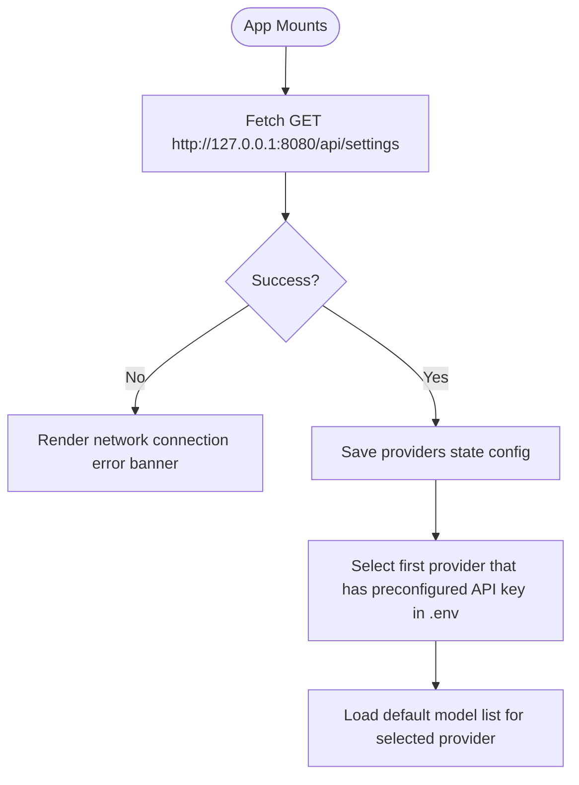

# Frontend Architecture & Flow Implementation (`frontend`)

This document outlines the technical details and flow charts for the React + TypeScript frontend client located in the `/frontend` directory.

---

## 🛠️ Tech Stack Specifications

- **Core**: [React 19](https://react.dev/) & [TypeScript](https://www.typescriptlang.org/) for robust static type checking.
- **Build System**: [Vite](https://vite.dev/) for extremely fast Hot Module Replacement (HMR) and compilation.
- **Styling**: Pure **Vanilla CSS** with unified custom HSL color palettes and smooth typography. No bulky grid libraries or tailwind templates are used, ensuring a clean and lightweight package size.

---

## 📂 Codebase Structures

```
frontend/
├── package.json         # NPM script setups and dependencies
├── vite.config.ts       # Vite bundler parameters
├── index.html           # Main template target
└── src/
    ├── main.tsx         # Entry point executing React tree render
    ├── App.tsx          # Main application orchestrator passing states to sub-components
    ├── App.css          # Customized HSL layout themes and keyframe anims
    ├── index.css        # Simple CSS reset clearing default templates
    ├── types.ts         # Centralized domain TypeScript declarations
    ├── components/      # Modular, reusable presentation components
    │   ├── ChatHeader.tsx    # Renders the system header and model indicator
    │   ├── MessageList.tsx   # Displays conversation bubbles and typing animations
    │   ├── ChatInput.tsx     # Message input form with send action button
    │   └── SettingsModal.tsx # Tabbed config modal for providers, models, names, and tones
    └── utils/           # Helper utility modules
        └── storage.ts   # Persistent configuration helpers utilizing browser localStorage
```

## 🧱 Component Architecture

To maintain high code quality and separation of concerns, the client UI is broken down into highly specialized sub-components, orchestrated by the main `App.tsx` state container:

1. **`App.tsx`**: Serves as the central state hub and orchestrates async FastAPI endpoint interactions (fetching history, model listing catalogs, sending/clearing messages).
2. **`components/ChatHeader.tsx`**: Lightweight navigation component showing the active model and toggling the settings pane.
3. **`components/MessageList.tsx`**: Renders message bubbles chronologically and handles loading indicator triggers.
4. **`components/ChatInput.tsx`**: Manages user typed message entries and keyboard submissions.
5. **`components/SettingsModal.tsx`**: Isolates model selection, system prompt settings, dynamic validation visual tags, and thread resetting routines. Encapsulates its own staging settings and tab toggles, returning clean updates to the parent hub on save.

---

## 📄 Detailed File Breakdown & Architecture ("Why")

Below is a detailed analysis of what each file in the modular structure implements and the architectural reasoning ("why") for its extraction:

### 1. `types.ts`
* **What it is**: The centralized schema definition file containing the core TypeScript interfaces:
  * `Message`: Mapped standard roles (`system`, `user`, `assistant`) and textual content values.
  * `ProviderInfo`: Metadata about supported LLM model directories.
  * `SettingsResponse`: Unified container mapping multiple active engine providers and tones.
  * `PromptConfig`: Parameters adjusting the chatbot's custom name and voice tone.
* **Why**:
  * **Strict Data Alignment**: Prevents schema drift by ensuring frontend states perfectly mirror backend Pydantic models (such as `PromptConfig` in the API layer).
  * **Zero Circular Imports**: By keeping interfaces completely separated from logic, multiple components can import the same typing structures without risk of circular compiler references.
  * **Type-Only Safety**: Satisfies the build compiler's strict `verbatimModuleSyntax` rules, optimizing tree-shaking during the production Vite build pipeline.

### 2. `utils/storage.ts`
* **What it is**: A dedicated browser persistence utility exporting `STORAGE_KEYS`, `DEFAULT_PROMPT_CONFIG`, and robust CRUD wrappers (`loadSetting`, `saveSetting`, `loadPromptConfig`, `savePromptConfig`).
* **Why**:
  * **Decoupled Window Side-Effects**: Directly interacting with `window.localStorage` inside UI components is an anti-pattern. Moving this out keeps React components purely focused on declarative rendering.
  * **Robust Fault Tolerance**: LocalStorage raw lookups can fail, and JSON serialization of corrupt configurations causes crashes. The storage layer captures exceptions and cleanly rolls back to pre-seeded configurations (`DEFAULT_PROMPT_CONFIG`).
  * **State Rehydration**: Simplifies the state initialization blocks in `App.tsx` into clean, one-line initializers (e.g. `useState(() => loadPromptConfig())`).

### 3. `components/ChatHeader.tsx`
* **What it is**: Renders the application's navbar displaying active LLM status models and the collapsible settings menu toggle button.
* **Why**:
  * **Render Path Optimization**: Isolates the navigation and status bar elements. Changes to other dynamic layout details do not cause header re-renders, resulting in highly fluid UI transitions.
  * **Separation of Presentation**: Ensures the global brand layout and model status representation are encapsulated, preventing structural changes from leaking into conversational feed blocks.

### 4. `components/MessageList.tsx`
* **What it is**: Renders the conversation stream (filtered to hide system messages), dynamic AI typing bubble indicators, and handles viewport scroll position alignment.
* **Why**:
  * **Encapsulated DOM Referencing**: Relies on a shared `chatEndRef` to trigger smooth scroll alignments (`scrollIntoView({ behavior: 'smooth' })`). By confining the scrolling effect logic to the message container, it prevents unintended layout jumps or scrolling issues in the outer layout.
  * **Isolated Loading Feeds**: The typing indicator dot structure is kept distinct from main user messaging layouts, improving render efficiency.

### 5. `components/ChatInput.tsx`
* **What it is**: Renders the user conversation input bar, text submit forms, disabled loading fields, and dynamic placeholder targets.
* **Why**:
  * **Reducing Typing Lag**: Frequently updating state while typing (`onChange`) in a massive monolithic file triggers broad component re-renders. Decoupling the input element controls minimizes local state updates and maintains absolute UI responsiveness.
  * **Reusable Form Logic**: Decouples validation checks (blocking empty strings) and keyboard trigger mechanisms.

### 6. `components/SettingsModal.tsx`
* **What it is**: Manages the LLM connection dashboard, system configurations, tab-switching views, local draft configuration staging, and clear history routines.
* **Why**:
  * **Encapsulated Editing States**: Users editing the chatbot name or tone should have their changes kept in draft stage (`tempPromptConfig`) until they explicitly click "Save Changes". Keeping this temporary state inside the modal means if the user closes it without saving, the changes are cleanly discarded.
  * **Sub-layout Decoupling**: Renders a complex form overlay structure. Placing it in its own file drastically declutters `App.tsx`, reducing visual complexity and improving code readability.

### 7. `App.tsx`
* **What it is**: The main entry point orchestrating state configurations (thread IDs, model provider mappings, active dialogs) and FastAPI server endpoints (sending messages, clearing chat logs).
* **Why**:
  * **Unified State Hub**: Acts as the single source of truth for conversational sequences and connection profiles.
  * **Async Workflow Orchestration**: Concentrates state management and API communication in one central controller, while visual representation is delegated to highly focused sub-components.

---


## 💾 State Machine Schema (`App.tsx`)

To keep the application highly responsive, `App.tsx` manages a centralized series of reactive states:

| State Variable | Data Type | Purpose |
| :--- | :--- | :--- |
| `messages` | `Message[]` | The array of conversational steps rendering in the chat screen (System, Human, AI bubbles). |
| `providers` | `Record<string, ProviderInfo>` | List of LLM options and environmental key availability flags populated by `/api/settings` on load. |
| `selectedProvider` | `string` | The active LLM engine category selected (e.g. `openai`, `gemini`). |
| `selectedModel` | `string` | The specific model string selected within the provider subgroup (e.g. `gpt-4o-mini`). |
| `isLoading` | `boolean` | Flag to trigger visual loader (typing dot animation) and disable input forms. |
| `errorMsg` | `string \| null` | Stores API exception alerts for dynamic UI banners. |
| `promptConfig` | `PromptConfig` | Current name and tone options mapped to system behavior. |


---

## 🔄 User Interaction Flows

### 1. Initialization Flow (Component Mount)


### 2. Message Transmission Flow
When the user types a prompt and submits the chat input:
1. **Local Update**:
   - Create a message dictionary: `{ role: 'user', content: inputValue }`.
   - Append to `messages` state list (instantly renders human speech bubble on the right).
   - Clear input text field.
   - Set `isLoading = true` (disables input bar and triggers typing dots loading bubble).
2. **API Dispatch**:
   - Send `POST` request to `http://127.0.0.1:8080/api/chat` with body:
     ```json
     {
       "messages": [...allMessages, userMessage],
       "provider": "selectedProvider",
       "model": "selectedModel"
     }
     ```
3. **API Resolution**:
   - On success: append the returned `{ role: 'assistant', content: '...' }` to the message state list.
   - On error: display red alert banner with error details.
   - Turn `isLoading = false` (input elements re-enable, dots fade out).
4. **Layout Sync**:
   - Use `useRef()` element bindings to smoothly scroll the chat log to the bottom, ensuring the new response is visible.

---

## 🎨 Styling Specifications (`App.css`)

The application adopts a **Modern Tech Dark Aesthetic** using customized CSS variables:

### 1. CSS Custom Properties
```css
:root {
  --bg-primary: #121316;     /* Full dark base background */
  --bg-secondary: #1a1c22;   /* Card, header, sidebar panel color */
  --border-color: #2a2e37;   /* Slim borders separator */
  --text-main: #f3f4f6;
  --primary: #3b82f6;        /* Bright neon blue for human speech bubble and buttons */
  --bot-bg: #292d38;         /* Deep slate for AI messages */
}
```

### 2. Micro-Animations (Typing Dots Bounce)
To provide instant interactive feedback during AI invocation, the loading bubble features a clean, CSS-based typing indicator. Individual span dots bounce with staggered keyframe delays:
```css
.typing-dots span {
  width: 6px;
  height: 6px;
  background-color: var(--text-muted);
  border-radius: 50%;
  animation: bounce 1.3s infinite ease-in-out both;
}
.typing-dots span:nth-child(1) { animation-delay: -0.32s; }
.typing-dots span:nth-child(2) { animation-delay: -0.16s; }

@keyframes bounce {
  0%, 80%, 100% { transform: scale(0); }
  40% { transform: scale(1.0); }
}
```
